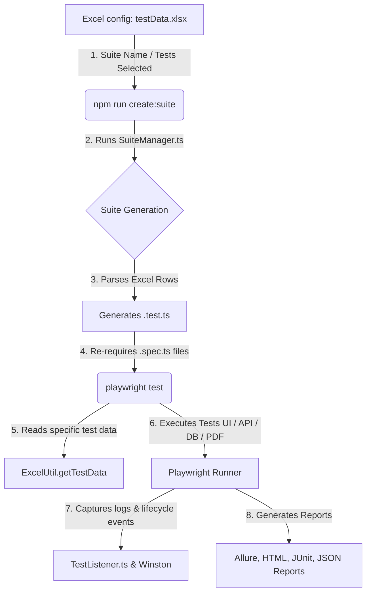
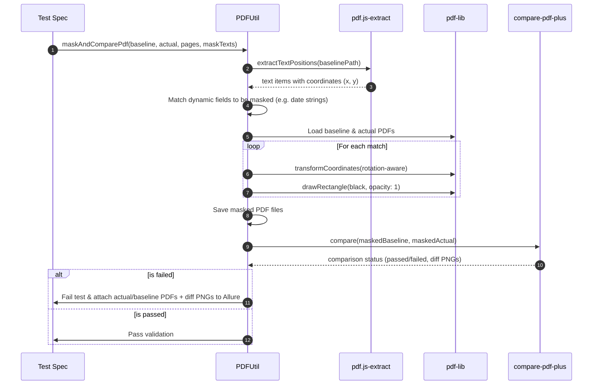

# Product Requirements Document (PRD)
## Playwright QA Automation Framework

---

### 1. Document Control
| Version | Date | Author | Status | Target Audience |
| :--- | :--- | :--- | :--- | :--- |
| **v1.0.0** | June 3, 2026 | Antigravity AI | Ready for Review | QA Engineers, Developers, DevOps, Project Stakeholders |

---

### 2. Executive Summary & Goals

#### 2.1 Background
Enterprise software systems typically involve multiple integration touchpoints, including web user interfaces, RESTful and SOAP-based web services, relational databases, and generated documents (such as invoices or statements in PDF format). Traditional automation test suites are often highly fragmented, with separate tools for UI (e.g., Selenium), API (e.g., Postman/SoapUI), and database validation. This fragmentation leads to high maintenance overhead, reporting silos, and limited verification of end-to-end user journeys.

#### 2.2 Objective & Mission
The **Playwright QA Automation Framework** is designed to unify UI, API (REST & SOAP), Database, and Document verification into a single, high-performance, and extensible test automation codebase. It utilizes **Playwright** with **TypeScript** to achieve rapid, cross-browser, and parallel testing.

#### 2.3 Key Value Propositions
* **Data-Driven Architecture:** Decouples test script logic from test execution configuration and test input data using external Excel sheets (`testData.xlsx`).
* **High Efficiency & Reduced Redundancy:** Executes the same test scenario against different data sets, minimizing code duplication.
* **Unified Reporting:** Consolidates logs, execution results, screenshots, videos, and custom attachments (e.g., PDF diff files) into a single, interactive report dashboard (Allure & Playwright HTML).
* **Advanced Document Verification:** Automates PDF comparisons by dynamically masking volatile, time-dependent, or transaction-specific fields (e.g., timestamps, dynamically-generated order IDs) before performing pixel-by-pixel comparisons.

---

### 3. Target Audience & Roles

The framework addresses three main user personas:
1. **QA Automation Engineer:** Writes step-definition libraries, page object models, and configures test cases in Excel worksheets.
2. **Software Developer:** Runs individual tests locally in UI mode to verify feature changes before code submission.
3. **DevOps Engineer / Release Manager:** Integrates the execution script (`npm run create:suite && npm test`) into CI/CD pipelines (e.g., Jenkins) to guard product branches.

---

### 4. Technical Architecture & Tech Stack

#### 4.1 System Architecture Flow
Below is the execution flow, from test selection in Excel through dynamic compilation to final reporting:

#### 4.2 Core Technologies
* **Execution & Runtime:** Node.js (v22+) & TypeScript (v4.5+).
* **Test Engine:** `@playwright/test` (v1.55+).
* **Reporting Engines:** `allure-playwright`, Playwright HTML reporter, JUnit XML parser.
* **Logger:** `winston` for robust, timestamped console and file output logging.
* **Excel Processor:** `convert-excel-to-json`.
* **API Utilities:** `easy-soap-request`, `xpath`, `xmldom`, `fetch-to-curl`.
* **Database Drivers:** `mssql`, `oracledb`, `ibm_db`.
* **PDF Utility Libraries:** `pdf.js-extract`, `pdf-lib` (for drawing masks), `compare-pdf-plus` (for pixel comparison), `resemblejs`.

---

### 5. Functional Requirements (Core Modules)

#### 5.1 Dynamic Data-Driven & Suite Control
The framework must enable users to configure and schedule test executions entirely via spreadsheets.

* **F-5.1.1 Suite Execution Control:** Users must be able to define a suite worksheet (e.g., `Regression`) listing all tests, with a `Run` column (set to `YES` or blank/`NO`) and a `Mode` column.
* **F-5.1.2 Execution Modes:** Supported running modes must include:
  * **Normal (Default):** Runs tests sequentially.
  * **Serial:** Runs sequentially, but immediately stops on the first failure (preventing cascading failures in dependent chains).
  * **Parallel:** Configures the test block (`test.describe.configure({ mode: 'parallel' })`) to utilize all available workers.
* **F-5.1.3 Test Data Mapping:** Tests must locate their row-based parameters using a unique `TestID` key matching the spec file's request (e.g., `TC01_ValidLogin`).

#### 5.2 UI Testing Layer
The UI testing layer implements the Page Object Model (POM) pattern to isolate UI interactions from tests.

* **F-5.2.1 Object Abstraction Wrapper:** Raw Playwright actions must be abstracted into domain-specific wrappers (e.g., `UIActions`, `UIElementActions`, `EditBoxActions`, `CheckBoxActions`, `DropDownActions`, `AlertActions`) to:
  * Standardize error handling and element timeouts.
  * Embed logging and diagnostic output for every interaction.
  * Automatically take screenshots and record video when UI tests fail.
* **F-5.2.2 Live Demo Application:** A standard deployment of `advantageonlineshopping.com` is targeted for smoke, registration, and checkout test cases.
* **F-5.2.3 Dynamic Account Registration:** To ensure pipeline stability, the framework must auto-register a randomized test account at runtime if pre-configured environment credentials are not present in `.env`.

#### 5.3 API Testing Layer
The framework must provide unified helpers for REST and SOAP communication.

* **F-5.3.1 SOAP Request Handler:** An wrapper around HTTP POST requests that automatically inserts SOAP headers, submits XML payloads, parses responses using DOM-based parser interfaces (`xmldom`), and validates fields using XPath selectors.
* **F-5.3.2 REST Request Wrapper:** Support for CRUD REST operations with dynamic header handling, cookie preservation, and curl-command output generation (using `fetch-to-curl`) to assist debuggers in reproducing API errors.

#### 5.4 Database Verification Layer
To perform end-to-end verification, the framework must query backend databases directly to confirm transaction updates.

* **F-5.4.1 Multi-Database Support:** Integrated client interfaces for:
  * **MSSQL** (Microsoft SQL Server)
  * **Oracle DB**
  * **IBM DB2**
* **F-5.4.2 Config-Driven Connections:** Connections must be established dynamically using connection strings read from the environment variables, ensuring SQL credentials are kept out of source code.

#### 5.5 Advanced PDF Comparisons & Dynamic Masking
A critical requirement is comparing generated documents (e.g., invoices) against gold-standard baseline files, ignoring transient data fields.

* **F-5.5.1 Content Parsing:** Extract text strings alongside their bounding coordinates (x, y, width, height) using `pdf.js-extract`.
* **F-5.5.2 Rotation Correction:** Automatically recalculate bounding coordinates depending on PDF page rotation angle (0, 90, 180, 270 degrees).
* **F-5.5.3 Volatile Content Masking:** Draw black opaque rectangles over target texts matching dynamic values (e.g., today's date, unique reference number) on both the baseline and actual documents using `pdf-lib` to ensure pixel-perfect stability.
* **F-5.5.4 Visual Diff Analysis:** Compare the output documents using a pixel comparison engine, allowing configurable tolerance levels, and output a PNG visual difference highlighting changes.

#### 5.6 Reporting & Diagnostics
* **F-5.6.1 Execution Logs:** A custom `TestListener` hooked into Playwright's reporter lifecycle must format and log every start, step, end, and failure to `test-results/logs/execution.log` via Winston.
* **F-5.6.2 Allure Interactive Report:** Detailed reporting containing suite hierarchies, test status, step execution duration, failure stack traces, embedded screenshots, screen recordings, and PDF/image comparison files.
* **F-5.6.3 CI Integration Files:** Standardized JUnit XML format report creation at `test-results/results/results.xml` to allow CI engines (e.g., Jenkins) to parse test pass/fail metrics.

---

### 6. Non-Functional Requirements (NFRs)

#### 6.1 Security
* **Credential Isolation:** No login passwords, database secrets, or API tokens must be saved in the git repository. They must reside in a local, git-ignored `.env` file.
* **Fallback Assertions:** Tests must immediately crash and explain which credential key is missing if required `.env` values are left undefined at startup.

#### 6.2 Performance & Resource Management
* **Resource Parallelization:** Support running independent specs concurrently up to the maximum threads defined by the `PARALLEL_THREAD` env variable.
* **Cleanup Actions:** Temporary files generated during browser downloads and PDF conversions must be cleaned, or contained in `test-results/` folder which is ignored by version control.

#### 6.3 Maintainability & Reliability
* **Clean Action Wrappers:** Test scripts should not call raw Playwright API functions directly; they should rely on page action methods, which in turn use standard action wrappers.
* **Retry Capability:** Support automated retries (`RETRIES` variable in configuration) for resolving minor network or page layout rendering hiccups.

---

### 7. Future Enhancements & Roadmap
* **Auto-Sync Excel Matrix:** A utility script to synchronize test spec code declarations directly into the Excel execution sheet, avoiding manual configuration errors.
* **Cloud Execution Grid Integrations:** Integration hooks for running suites on containerized Selenium/Playwright grids (e.g., Docker Selenoid or Playwright Service).
* **AI Page Object Locator Healing:** An AI-powered locator search strategy that attempts to recover broken POM locators dynamically when DOM changes occur.
