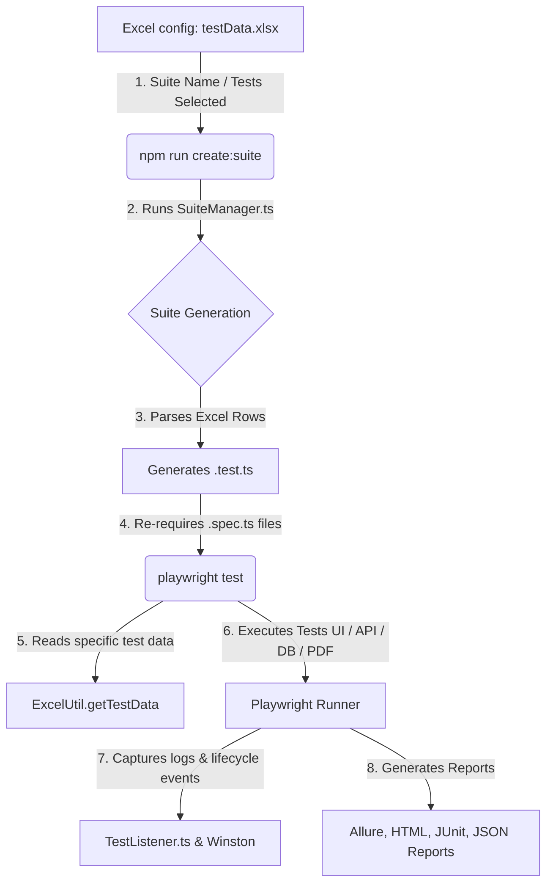
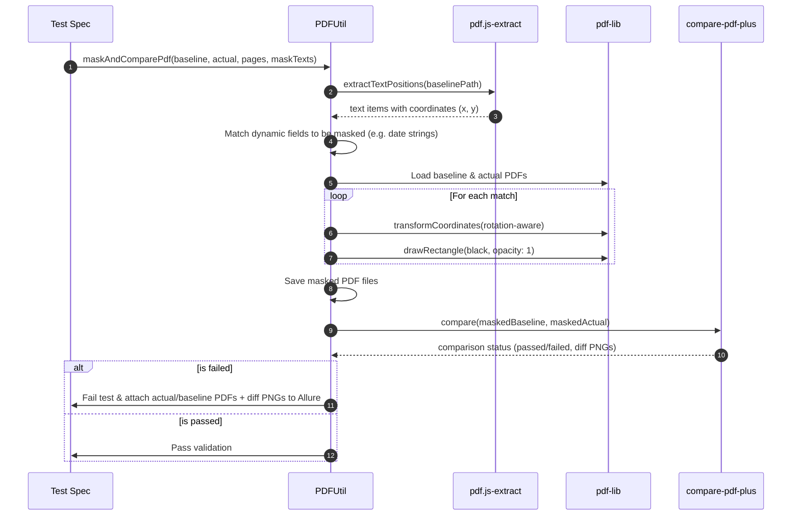

# Product Requirements Document (PRD)
## Playwright QA Automation Framework

---

### 1. Document Control
| Version | Date | Author | Status | Target Audience |
| :--- | :--- | :--- | :--- | :--- |
| **v1.3.0** | June 10, 2026 | Antigravity AI | Ready for Review | QA Engineers, Developers, DevOps, Project Stakeholders |
| **v1.2.0** | June 10, 2026 | Antigravity AI | Historical | QA Engineers, Developers, DevOps, Project Stakeholders |
| **v1.1.0** | June 3, 2026 | Antigravity AI | Historical | QA Engineers, Developers, DevOps, Project Stakeholders |
| **v1.0.0** | June 3, 2026 | Antigravity AI | Historical | QA Engineers, Developers, DevOps, Project Stakeholders |

---

### 2. Executive Summary & Goals

#### 2.1 Background
Enterprise software systems typically involve multiple integration touchpoints, including web user interfaces, RESTful and SOAP-based web services, relational databases, and generated documents (such as invoices or statements in PDF format). Traditional automation test suites are often highly fragmented, with separate tools for UI (e.g., Selenium), API (e.g., Postman/SoapUI), and database validation. This fragmentation leads to high maintenance overhead, reporting silos, and limited verification of end-to-end user journeys.

#### 2.2 Objective & Mission
The **Playwright QA Automation Framework** is designed to unify UI, API (REST & SOAP), Database, and Document verification into a single, high-performance, and extensible test automation codebase. It utilizes **Playwright** with **TypeScript** to achieve rapid, cross-browser, and parallel testing.

#### 2.3 Key Value Propositions
* **Data-Driven Architecture:** Decouples test script logic from test execution configuration and test input data using external Excel sheets (`testData.xlsx`).
* **High Efficiency & Reduced Redundancy:** Executes the same test scenario against different data sets, minimizing code duplication.
* **Unified Reporting:** Consolidates logs, execution results, screenshots, videos, and custom attachments (e.g., PDF diff files) into a single, interactive report dashboard (Allure & Playwright HTML).
* **Advanced Document Verification:** Automates PDF comparisons by dynamically masking volatile, time-dependent, or transaction-specific fields (e.g., timestamps, dynamically-generated order IDs) before performing pixel-by-pixel comparisons.
* **Visual Regression Automation:** Leverages pixel-level image comparisons with automatic baseline provisioning to detect UI regressions.

---

### 3. Target Audience & Roles

The framework addresses three main user personas:
1. **QA Automation Engineer:** Writes step-definition libraries, page object models, and configures test cases in Excel worksheets.
2. **Software Developer:** Runs individual tests locally in UI mode to verify feature changes before code submission.
3. **DevOps Engineer / Release Manager:** Integrates the execution script (`npm run create:suite && npm test`) into CI/CD pipelines (e.g., Jenkins) to guard product branches.

---

### 4. Technical Architecture & Tech Stack

#### 4.1 System Architecture Flow
Below is the execution flow, from test selection in Excel through dynamic compilation to final reporting:



#### 4.2 Core Technologies
* **Execution & Runtime:** Node.js (v22+) & TypeScript (v4.5+).
* **Test Engine:** `@playwright/test` (v1.55+).
* **Reporting Engines:** `allure-playwright`, Playwright HTML reporter, JUnit XML parser.
* **Logger:** `winston` for robust, timestamped console and file output logging.
* **Excel Processor:** `convert-excel-to-json`.
* **API Utilities:** `easy-soap-request`, `xpath`, `xmldom`, `fetch-to-curl`.
* **Database Drivers:** `mssql`, `oracledb`, `ibm_db`.
* **PDF Utility Libraries:** `pdf.js-extract`, `pdf-lib` (for drawing masks), `compare-pdf-plus` (for pixel comparison), `resemblejs`.

#### 4.3 Code Quality & Formatting Standards
The project strictly enforces coding guidelines via ESLint rules configured in `.eslintrc.json`:
* **Inherited Rule Sets:** Extends `eslint:recommended`, `airbnb-base`, `airbnb-typescript/base`, `plugin:@typescript-eslint/recommended`, and `plugin:playwright/playwright-test`.
* **Key Configuration Customizations:**
  * **Line Limit:** Strict warning on lines exceeding **120 characters** (excluding comments, template literals, and URLs) to preserve readability on split screens.
  * **Syntactic Restraints:** Enforces semicolons globally; allows relaxed rules for quotes (`quotes: off`), class spacing (`lines-between-class-members: off`), and variable prefixes (`no-underscore-dangle: off`).
  * **Asynchronous Operations:** Allows `no-await-in-loop` to support sequential business validation steps which must proceed in order.

#### 4.4 Resource & Payload Directory Mapping
Test resources are structured to keep baseline documents, spreadsheets, and request templates separated from the codebase:

```plaintext
src/resources/
├── API/
│   ├── REST/                      # REST JSON request bodies (e.g., ADD_USER.json, LOGIN.json)
│   └── SOAP/                      # SOAP XML payload envelopes (e.g., AccountCreateRequest.xml)
├── data/
│   └── testData.xlsx              # Execution configuration & test data records
└── pdf/
    └── baseline/                  # Golden baseline PDF files for structural validation
```

---

### 5. Functional Requirements (Core Modules)

#### 5.1 Dynamic Data-Driven & Suite Control
The framework must enable users to configure and schedule test executions entirely via spreadsheets.

* **F-5.1.1 Suite Execution Control:** Users must be able to define a suite worksheet (e.g., `Regression`) listing all tests, with a `Run` column (set to `YES` or blank/`NO`) and a `Mode` column.
* **F-5.1.2 Execution Modes:** Supported running modes must include:
  * **Normal (Default):** Runs tests sequentially.
  * **Serial:** Runs sequentially, but immediately stops on the first failure (preventing cascading failures in dependent chains).
  * **Parallel:** Configures the test block (`test.describe.configure({ mode: 'parallel' })`) to utilize all available workers.
* **F-5.1.3 Test Data Mapping:** Tests must locate their row-based parameters using a unique `TestID` key matching the spec file's request (e.g., `TC01_ValidLogin`).
* **F-5.1.4 Worksheet Configuration Mapping:** For data-driven variables, sheets must follow a strict header row convention. Column cell values map directly to endpoint parameters, request templates, xpath asserts, expected statuses, and target database verification statements.

#### 5.2 UI Testing Layer (POM Separation Design)
To isolate UI modifications from testing scenarios, the framework utilizes a clean Page Object Model separation:

```
[UI Test Spec (.spec.ts)]
         │
         ▼
[Step Definitions (*Steps.ts)] ──► Uses UIActions (Wrapper API)
         │
         ▼
[Page Selectors (*Page.ts)] ──────► Enforces locator isolation
```

* **F-5.2.1 Component Separation:**
  * **Selectors/Locators:** Declarative strings, XPath expressions, and dynamic template functions are stored isolated in a Page class (e.g., `HomePage.ts`). Page classes must contain *no test assertions or execution logic*.
  * **Step Actions:** Business logical workflows, test expectations, and step logging hooks are declared inside Steps classes (e.g., `HomeSteps.ts`). Steps classes act as orchestrators using Playwright's `test.step` syntax to segment logs.
* **F-5.2.2 Object Abstraction Wrapper:** Raw Playwright actions must be abstracted into domain-specific wrappers (e.g., `UIActions`, `UIElementActions`, `EditBoxActions`, `CheckBoxActions`, `DropDownActions`, `AlertActions`) to standardize error handling and element timeouts, and embed logging and diagnostic output for every interaction.
* **F-5.2.3 Dynamic Account Registration:** To ensure pipeline stability, the framework must auto-register a randomized test account at runtime if pre-configured environment credentials are not present in `.env`.
* **F-5.2.4 Window, Alert, and Download Handlers:**
  * **Native Dialog Handling:** The framework must intercept alerts, confirmation boxes, and prompt boxes (using wrappers `acceptAlertOnElementClick`, `dismissAlertOnElementClick`, `acceptPromptOnElementClick`) utilizing Playwright's event listeners.
  * **Tab / Window Context Switching:** Navigating to new tabs or popup windows must be handled asynchronously via `switchToNewWindow` by waiting for context `page` listener resolutions before binding locators to the new view.
  * **Download Manager:** Initiating file downloads must save streams to `./test-results/downloads/` with the server-supplied suggested filename (using `downloadFile`), cleanup temporary files, and avoid memory leakage.

#### 5.3 API Testing Layer (REST & SOAP Integration)
The framework must provide unified helpers for REST and SOAP communication.

* **F-5.3.1 REST Request Wrapper:** Support for CRUD REST operations with dynamic header handling and cookie preservation.
* **F-5.3.2 SOAP Request Handler:** A wrapper around HTTP POST requests that automatically inserts SOAP headers and submits XML payloads.
* **F-5.3.3 Template Parameterization:** API payload templates (both JSON and XML) must support brackets placeholders (e.g., `{userName}`, `{password}`, `{phoneNumber}`). These templates are resolved dynamically at runtime by formatting template values with targeted key-value replacement utility.
* **F-5.3.4 Request Debugging & curl Logging:** Outgoing REST requests must be format-logged to the execution logger in standard executable `curl` commands (utilizing `fetch-to-curl`), ensuring DevOps or developers can execute requests directly in shell terminals for fast verification.
* **F-5.3.5 XML DOM & XPath Extraction:** SOAP response payloads must be parsed via DOM Parser (`xmldom`) and validated using XPath queries (e.g., `XMLParserUtil.getTagContentByXpath`), permitting direct assertion of individual response elements.
* **F-5.3.6 JSONPath Node Extraction:** For REST validation, target values and assertions must be resolved by querying json paths (e.g. `$.id`, `$.username`) using the `jsonpath` library, allowing precise nested validations on JSON responses.

#### 5.4 Database Verification Layer
To perform end-to-end verification, the framework must query backend databases directly to confirm transaction updates.

* **F-5.4.1 Multi-Database Support:** Integrated client interfaces for:
  * **MSSQL** (Microsoft SQL Server)
  * **Oracle DB**
  * **IBM DB2**
* **F-5.4.2 Config-Driven Connections:** Connections must be established dynamically using connection strings read from the environment variables, ensuring SQL credentials are kept out of source code.

#### 5.5 Advanced PDF Comparisons & Dynamic Masking
A critical requirement is comparing generated documents (e.g., invoices) against gold-standard baseline files, ignoring transient data fields.



* **F-5.5.1 Content Parsing:** Extract text strings alongside their bounding coordinates (x, y, width, height) using `pdf.js-extract`.
* **F-5.5.2 Rotation Correction:** Automatically recalculate bounding coordinates depending on PDF page rotation angle (0, 90, 180, 270 degrees).
* **F-5.5.3 Volatile Content Masking:** Draw black opaque rectangles over target texts matching dynamic values (e.g., today's date, unique reference number) on both the baseline and actual documents using `pdf-lib` to ensure pixel-perfect stability.
* **F-5.5.4 Visual Diff Analysis:** Compare the output documents using a pixel comparison engine, allowing configurable tolerance levels, and output a PNG visual difference highlighting changes.

#### 5.6 Visual Image Comparison & Auto-Baselining
To catch structural CSS changes, layout slips, and canvas bugs, visual snapshot assertions must be supported.

* **F-5.6.1 Automated Baseline Provisioning:** When comparing an actual viewport screenshot with its baseline, if the baseline file does not exist, the framework must automatically copy the actual screenshot to the baseline target and pass the test. This facilitates low-overhead initialization of visual testing.
* **F-5.6.2 Resemble.js Engine Configuration:** The comparison engine must support:
  * **Antialiasing Filter:** Ignoring minor rendering differences caused by text antialiasing.
  * **Auto-Scaling:** Rescaling mismatched images to identical dimensions before comparing to avoid layout crash errors.
  * **Highlight Color:** Rendering visual discrepancies in bright Magenta (`#FF00FF`) overlay on the output diff image.
* **F-5.6.3 Custom Tolerance Configuration:** Tests must accept a customizable mismatch threshold (e.g., `misMatchTolerance = 0.05` allowing a 0.05% difference). If the differences exceed the tolerance, the diff image must be attached to the Allure report automatically.

#### 5.7 Reporting & Diagnostics
* **F-5.7.1 Execution Logs:** A custom `TestListener` hooked into Playwright's reporter lifecycle must format and log every start, step, end, and failure to `test-results/logs/execution.log` via Winston.
* **F-5.7.2 Allure Interactive Report:** Detailed reporting containing suite hierarchies, test status, step execution duration, failure stack traces, embedded screenshots, screen recordings, and PDF/image comparison files.
* **F-5.7.3 CI Integration Files:** Standardized JUnit XML format report creation at `test-results/results/results.xml` to allow CI engines (e.g., Jenkins) to parse test pass/fail metrics.

#### 5.8 Worker-Scoped Data Transfer & Session Chaining
The framework must support sequential dependencies where outputs of preceding test cases serve as inputs for subsequent test cases.

* **F-5.8.1 Context-Sharing Map:** A custom worker-scoped test fixture named `gData` (`Map<string, any>`) must be instantiated at the worker level. This enables parallelized worker threads to isolate their dynamic execution states while permitting consecutive tests in a single suite to read and write parameters.
* **F-5.8.2 Session and Transaction Chaining:**
  * **SOAP Flow:** Test cases must be able to write dynamic authentication hashes (e.g., XML `token`) or resource identifiers (e.g., `userId` extracted using XPath selectors) into `gData`, permitting subsequent logout or fetch actions to retrieve them dynamically.
  * **REST Flow:** User IDs generated dynamically via user registration must be stored in `gData` and automatically injected into subsequent put/delete URL parameters (e.g. replacing `{ID}` placeholders via path utilities).

---

### 6. Configuration Management (Environment Variable Schema)

The test run's behaviors are defined via environment parameters loaded by `playwright.config.ts` from `.env`:

| Key | Description | Example / Target Value |
| :--- | :--- | :--- |
| `BROWSER` | Target browser for execution | `chrome`, `firefox`, `edge`, `webkit` |
| `TEST_TIMEOUT` | Global limit for a single test block (in minutes) | `20` |
| `BROWSER_LAUNCH_TIMEOUT` | Timeout limit for browser initialization (in ms) | `0` (disabled) |
| `ACTION_TIMEOUT` | Timeout for element locator operations (in minutes) | `1` |
| `NAVIGATION_TIMEOUT` | Timeout for page load and routing actions (in minutes) | `2` |
| `RETRIES` | Number of times a failed test is automatically re-run | `0` |
| `PARALLEL_THREAD` | Maximum concurrent worker processes spawned | `3` |
| `BASE_URL` | Application root URL | `http://advantageonlineshopping.com` |
| `SOAP_API_BASE_URL` | Root URL for SOAP service verification | `http://www.advantageonlineshopping.com:80` |
| `REST_API_BASE_URL` | Root URL for REST mock service validation | `https://fakestoreapi.com` |
| `DB_CONFIG` | Driver-specific DB connection string | `Server=localhost,1433;Database=AutomationDB;...` |
| `TEST_NAME` | Regex identifier for local filter matching | `LoginTest` |

---

### 7. Non-Functional Requirements (NFRs)

#### 7.1 Security
* **Credential Isolation:** No login passwords, database secrets, or API tokens must be saved in the git repository. They must reside in a local, git-ignored `.env` file.
* **Fallback Assertions:** Tests must immediately crash and explain which credential key is missing if required `.env` values are left undefined at startup.

#### 7.2 Performance & Resource Management
* **Resource Parallelization:** Support running independent specs concurrently up to the maximum threads defined by the `PARALLEL_THREAD` env variable.
* **Cleanup Actions:** Temporary files generated during browser downloads and PDF conversions must be cleaned, or contained in `test-results/` folder which is ignored by version control.

#### 7.3 Maintainability & Reliability
* **Client Action Wrappers:** Test scripts should not call raw Playwright API functions directly; they should rely on page action methods, which in turn use standard action wrappers.
* **Retry Capability:** Support automated retries (`RETRIES` variable in configuration) for resolving minor network or page layout rendering hiccups.

---

### 8. Future Enhancements & Roadmap
* **Auto-Sync Excel Matrix:** A utility script to synchronize test spec code declarations directly into the Excel execution sheet, avoiding manual configuration errors.
* **Cloud Execution Grid Integrations:** Integration hooks for running suites on containerized Selenium/Playwright grids (e.g., Docker Selenoid or Playwright Service).
* **AI Page Object Locator Healing:** An AI-powered locator search strategy that attempts to recover broken POM locators dynamically when DOM changes occur.
